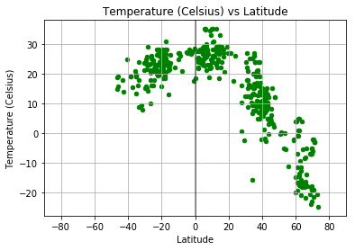
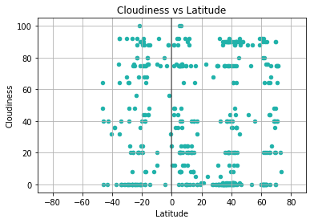

<h1>Unit 6 | Assignment - What's the Weather Like?</h1>

<h4>Background</h4>
Whether financial, political, or social -- data's true power lies in its ability to answer questions definitively. So let's take what you've learned about Python requests, APIs, and JSON traversals to answer a fundamental question: "What's the weather like as we approach the equator?"

Now, we know what you may be thinking: "Duh. It gets hotter..."

But, if pressed, how would you prove it?

<h4>WeatherPy</h4>
In this example, you'll be creating a Python script to visualize the weather of 500+ cities across the world of varying distance from the equator. To accomplish this, you'll be utilizing a simple Python library, the OpenWeatherMap API, and a little common sense to create a representative model of weather across world cities.

Your objective is to build a series of scatter plots to showcase the following relationships:
<ul>
<li>Temperature (F) vs. Latitude</li>
<li>Humidity (%) vs. Latitude</li>
<li>Cloudiness (%) vs. Latitude</li>
<li>Wind Speed (mph) vs. Latitude</li>
</ul>

<h4>Initial Setup:</h4>
<ul>
<li>Import Dependencies</li>
<li>Bring in url and save to a variable</li></ul>


```python
#Dependencies 
import openweathermapy.core as owm
from citipy import citipy
import random
import requests
import pandas as pd
import numpy as np
import matplotlib.pyplot as plt
import matplotlib
import seaborn as sns

# Bring in API Key from https://openweathermap.org/
from config import api_key
```


```python
#Generate random cities 

# Set Latitude & Longitude to randomly pick coordinates 
# We want to have some from each region.
lat_zone = np.arange(-90,90,15)
lon_zone = np.arange(-200,200,15)

#Create a dataframe to hold the random cities
cities_df = pd.DataFrame() 

#Add colums to dataframe
cities_df["Latitude"] = ""
cities_df["Longitude"] = ""

#From each zone, randomly pick 50 unique coordinates and add them to our above cities_df dataframe.
for x in lat_zone:
    for y in lon_zone:
        x_values = list(np.arange(x, x + 15, 0.01))
        y_values = list(np.arange(y, y + 15, 0.01))
        lats = random.sample(x_values, 50)
        lons = random.sample(y_values, 50)
        lat_samples = [(x + dec_lat) for dec_lat in lats]
        lon_samples = [y + dec_lon for dec_lon in lons]
        cities_df = cities_df.append(pd.DataFrame.from_dict({"Latitude":lat_samples,
                                       "Longitude":lon_samples}))
cities_df = cities_df.reset_index(drop=True)
cities_df.shape
#cities_df.head(20)
```


    (16200, 2)


```python
#Now we want to use the citipy module to associate the lat and lon with the nearest city
cities_df["Closest City name"] = ""
cities_df["Closest Country code"] = ""

#We want to itterate throught the rows in the dataframe to pull in the lat/lon and find nearest city
for index, row in cities_df.iterrows():
    city = citipy.nearest_city(row["Latitude"],row["Longitude"])
    cities_df.set_value(index,"Closest City name",city.city_name)
    cities_df.set_value(index,"Closest Country code",city.country_code)
    
```


```python
#Now we will drop the random lats and lons from dataframe since they are not the exact coordinates for our cities.
clean_cities_df = cities_df.drop(['Latitude', 'Longitude'],axis=1)
clean_cities_df.head(20)
```


<div>
<style>
    .dataframe thead tr:only-child th {
        text-align: right;
    }

    .dataframe thead th {
        text-align: left;
    }

    .dataframe tbody tr th {
        vertical-align: top;
    }
</style>
<table border="1" class="dataframe">
  <thead>
    <tr style="text-align: right;">
      <th></th>
      <th>Closest City name</th>
      <th>Closest Country code</th>
    </tr>
  </thead>
  <tbody>
    <tr>
      <th>0</th>
      <td>vaini</td>
      <td>to</td>
    </tr>
    <tr>
      <th>1</th>
      <td>vaini</td>
      <td>to</td>
    </tr>
    <tr>
      <th>2</th>
      <td>vaini</td>
      <td>to</td>
    </tr>
    <tr>
      <th>3</th>
      <td>vaini</td>
      <td>to</td>
    </tr>
    <tr>
      <th>4</th>
      <td>vaini</td>
      <td>to</td>
    </tr>
    <tr>
      <th>5</th>
      <td>vaini</td>
      <td>to</td>
    </tr>
    <tr>
      <th>6</th>
      <td>vaini</td>
      <td>to</td>
    </tr>
    <tr>
      <th>7</th>
      <td>vaini</td>
      <td>to</td>
    </tr>
    <tr>
      <th>8</th>
      <td>vaini</td>
      <td>to</td>
    </tr>
    <tr>
      <th>9</th>
      <td>vaini</td>
      <td>to</td>
    </tr>
    <tr>
      <th>10</th>
      <td>vaini</td>
      <td>to</td>
    </tr>
    <tr>
      <th>11</th>
      <td>vaini</td>
      <td>to</td>
    </tr>
    <tr>
      <th>12</th>
      <td>vaini</td>
      <td>to</td>
    </tr>
    <tr>
      <th>13</th>
      <td>vaini</td>
      <td>to</td>
    </tr>
    <tr>
      <th>14</th>
      <td>vaini</td>
      <td>to</td>
    </tr>
    <tr>
      <th>15</th>
      <td>vaini</td>
      <td>to</td>
    </tr>
    <tr>
      <th>16</th>
      <td>vaini</td>
      <td>to</td>
    </tr>
    <tr>
      <th>17</th>
      <td>vaini</td>
      <td>to</td>
    </tr>
    <tr>
      <th>18</th>
      <td>vaini</td>
      <td>to</td>
    </tr>
    <tr>
      <th>19</th>
      <td>vaini</td>
      <td>to</td>
    </tr>
  </tbody>
</table>
</div>


```python
#Now, we want to drop any duplicate cities which may have resulted in the previous step
clean_cities_df = clean_cities_df.drop_duplicates()

clean_cities_df.shape
#clean_cities_df.head(20) 
#Note: the clean_cities_df.head(20) from above should not match the results just printed. 
#All duplicates should be removed if the two printed dataframes do not match
```


    (910, 2)


```python
#From the clean_cities_df choose a sample size of 500 cities then proceed with the program and analysis 
selected_cities = clean_cities_df.sample(500)

selected_cities = selected_cities.reset_index(drop=True)
#selected_cities.head(20)
```

<h2>Setup OpenWeatherMap:</h2>


```python
# Setting up values for OpenWeatherMap API calls
# Save config information.
base_url = "http://api.openweathermap.org/data/2.5/weather?"
settings = {"units": "metric", "appid": api_key}
#query_url = f"{base_url}appid={api_key}&units={units}&q="
```


```python
# def encrypt_key(input_url):
#     return input_url[0:53]+"<api_key>"+input_url[85:]

def encrypt_key(input_url):
    return input_url[0:53]+"<HideKey>"+input_url[85:]

# To hide warnings
import warnings
warnings.filterwarnings('ignore')


for index,row in selected_cities.iterrows():
    settings["q"] =f'{row["Closest City name"]},{row["Closest Country code"]}'
    print(f"Retrieving weather information for {settings['q']}")
    city_weather_resp = requests.get(base_url,settings)
    print(encrypt_key(city_weather_resp.url))
    city_weather_resp  = city_weather_resp.json()
    selected_cities.set_value(index,"Latitude",city_weather_resp.get("coord",{}).get("lat"))
    selected_cities.set_value(index,"Longitude",city_weather_resp.get("coord",{}).get("lon"))
    selected_cities.set_value(index,"Temperature",city_weather_resp.get("main",{}).get("temp_max"))
    selected_cities.set_value(index,"Wind speed",city_weather_resp.get("wind",{}).get("speed"))
    selected_cities.set_value(index,"Humidity",city_weather_resp.get("main",{}).get("humidity"))
    selected_cities.set_value(index,"Cloudiness",city_weather_resp.get("clouds",{}).get("all"))
```

    Retrieving weather information for vestmanna,fo
    http://api.openweathermap.org/data/2.5/weather?units=<HideKey>d9c094806e657&q=vestmanna%2Cfo
    Retrieving weather information for butaritari,ki
    http://api.openweathermap.org/data/2.5/weather?units=<HideKey>d9c094806e657&q=butaritari%2Cki
    Retrieving weather information for yambio,sd
    http://api.openweathermap.org/data/2.5/weather?units=<HideKey>d9c094806e657&q=yambio%2Csd
    Retrieving weather information for bluff,nz
    http://api.openweathermap.org/data/2.5/weather?units=<HideKey>d9c094806e657&q=bluff%2Cnz
    Retrieving weather information for brewster,us
    http://api.openweathermap.org/data/2.5/weather?units=<HideKey>d9c094806e657&q=brewster%2Cus
    Retrieving weather information for victoria point,au
    http://api.openweathermap.org/data/2.5/weather?units=<HideKey>d9c094806e657&q=victoria+point%2Cau
    Retrieving weather information for lorengau,pg
    http://api.openweathermap.org/data/2.5/weather?units=<HideKey>d9c094806e657&q=lorengau%2Cpg
    Retrieving weather information for bowen,au
    http://api.openweathermap.org/data/2.5/weather?units=<HideKey>d9c094806e657&q=bowen%2Cau
    Retrieving weather information for sikeston,us
    http://api.openweathermap.org/data/2.5/weather?units=<HideKey>d9c094806e657&q=sikeston%2Cus
    Retrieving weather information for san matias,bo
    http://api.openweathermap.org/data/2.5/weather?units=<HideKey>d9c094806e657&q=san+matias%2Cbo
    Retrieving weather information for anloga,gh
    http://api.openweathermap.org/data/2.5/weather?units=<HideKey>d9c094806e657&q=anloga%2Cgh
    Retrieving weather information for azuaga,es
    http://api.openweathermap.org/data/2.5/weather?units=<HideKey>d9c094806e657&q=azuaga%2Ces
    Retrieving weather information for ruatoria,nz
    http://api.openweathermap.org/data/2.5/weather?units=<HideKey>d9c094806e657&q=ruatoria%2Cnz
    Retrieving weather information for marrakesh,ma
    http://api.openweathermap.org/data/2.5/weather?units=<HideKey>d9c094806e657&q=marrakesh%2Cma
    Retrieving weather information for porterville,us
    http://api.openweathermap.org/data/2.5/weather?units=<HideKey>d9c094806e657&q=porterville%2Cus
    Retrieving weather information for broken hill,au
    http://api.openweathermap.org/data/2.5/weather?units=<HideKey>d9c094806e657&q=broken+hill%2Cau
    Retrieving weather information for mwanza,mw
    http://api.openweathermap.org/data/2.5/weather?units=<HideKey>d9c094806e657&q=mwanza%2Cmw
    Retrieving weather information for zonguldak,tr
    http://api.openweathermap.org/data/2.5/weather?units=<HideKey>d9c094806e657&q=zonguldak%2Ctr
    Retrieving weather information for racine,us
    http://api.openweathermap.org/data/2.5/weather?units=<HideKey>d9c094806e657&q=racine%2Cus
    Retrieving weather information for collierville,us
    http://api.openweathermap.org/data/2.5/weather?units=<HideKey>d9c094806e657&q=collierville%2Cus
    Retrieving weather information for bantogon,ph
    http://api.openweathermap.org/data/2.5/weather?units=<HideKey>d9c094806e657&q=bantogon%2Cph
    Retrieving weather information for saint george,bm
    http://api.openweathermap.org/data/2.5/weather?units=<HideKey>d9c094806e657&q=saint+george%2Cbm
    Retrieving weather information for tabiauea,ki
    http://api.openweathermap.org/data/2.5/weather?units=<HideKey>d9c094806e657&q=tabiauea%2Cki
    Retrieving weather information for lerwick,gb
    http://api.openweathermap.org/data/2.5/weather?units=<HideKey>d9c094806e657&q=lerwick%2Cgb
    Retrieving weather information for presidencia roque saenz pena,ar
    http://api.openweathermap.org/data/2.5/weather?units=<HideKey>d9c094806e657&q=presidencia+roque+saenz+pena%2Car
    Retrieving weather information for yefimovskiy,ru
    http://api.openweathermap.org/data/2.5/weather?units=<HideKey>d9c094806e657&q=yefimovskiy%2Cru
    Retrieving weather information for miri,my
    http://api.openweathermap.org/data/2.5/weather?units=<HideKey>d9c094806e657&q=miri%2Cmy
    Retrieving weather information for puerto ayacucho,ve
    http://api.openweathermap.org/data/2.5/weather?units=<HideKey>d9c094806e657&q=puerto+ayacucho%2Cve
    Retrieving weather information for mackay,au
    http://api.openweathermap.org/data/2.5/weather?units=<HideKey>d9c094806e657&q=mackay%2Cau
    Retrieving weather information for filingue,ne
    http://api.openweathermap.org/data/2.5/weather?units=<HideKey>d9c094806e657&q=filingue%2Cne
    Retrieving weather information for upington,za
    http://api.openweathermap.org/data/2.5/weather?units=<HideKey>d9c094806e657&q=upington%2Cza
    Retrieving weather information for angra,pt
    http://api.openweathermap.org/data/2.5/weather?units=<HideKey>d9c094806e657&q=angra%2Cpt
    Retrieving weather information for banda aceh,id
    http://api.openweathermap.org/data/2.5/weather?units=<HideKey>d9c094806e657&q=banda+aceh%2Cid
    Retrieving weather information for tondano,id
    http://api.openweathermap.org/data/2.5/weather?units=<HideKey>d9c094806e657&q=tondano%2Cid
    Retrieving weather information for aykhal,ru
    http://api.openweathermap.org/data/2.5/weather?units=<HideKey>d9c094806e657&q=aykhal%2Cru
    Retrieving weather information for murmashi,ru
    http://api.openweathermap.org/data/2.5/weather?units=<HideKey>d9c094806e657&q=murmashi%2Cru
    Retrieving weather information for cleveland,us
    http://api.openweathermap.org/data/2.5/weather?units=<HideKey>d9c094806e657&q=cleveland%2Cus
    Retrieving weather information for fortuna,us
    http://api.openweathermap.org/data/2.5/weather?units=<HideKey>d9c094806e657&q=fortuna%2Cus
    Retrieving weather information for honningsvag,no
    http://api.openweathermap.org/data/2.5/weather?units=<HideKey>d9c094806e657&q=honningsvag%2Cno
    Retrieving weather information for saint-pierre,mq
    http://api.openweathermap.org/data/2.5/weather?units=<HideKey>d9c094806e657&q=saint-pierre%2Cmq
    Retrieving weather information for birjand,ir
    http://api.openweathermap.org/data/2.5/weather?units=<HideKey>d9c094806e657&q=birjand%2Cir
    Retrieving weather information for yuci,cn
    http://api.openweathermap.org/data/2.5/weather?units=<HideKey>d9c094806e657&q=yuci%2Ccn
    Retrieving weather information for affery,ci
    http://api.openweathermap.org/data/2.5/weather?units=<HideKey>d9c094806e657&q=affery%2Cci
    Retrieving weather information for illoqqortoormiut,gl
    http://api.openweathermap.org/data/2.5/weather?units=<HideKey>d9c094806e657&q=illoqqortoormiut%2Cgl
    Retrieving weather information for kalaleh,ir
    http://api.openweathermap.org/data/2.5/weather?units=<HideKey>d9c094806e657&q=kalaleh%2Cir
    Retrieving weather information for lagos,ng
    http://api.openweathermap.org/data/2.5/weather?units=<HideKey>d9c094806e657&q=lagos%2Cng
    Retrieving weather information for svetlogorsk,ru
    http://api.openweathermap.org/data/2.5/weather?units=<HideKey>d9c094806e657&q=svetlogorsk%2Cru
    Retrieving weather information for winneba,gh
    http://api.openweathermap.org/data/2.5/weather?units=<HideKey>d9c094806e657&q=winneba%2Cgh
    Retrieving weather information for cidreira,br
    http://api.openweathermap.org/data/2.5/weather?units=<HideKey>d9c094806e657&q=cidreira%2Cbr
    Retrieving weather information for chicama,pe
    http://api.openweathermap.org/data/2.5/weather?units=<HideKey>d9c094806e657&q=chicama%2Cpe
    Retrieving weather information for sao borja,br
    http://api.openweathermap.org/data/2.5/weather?units=<HideKey>d9c094806e657&q=sao+borja%2Cbr
    Retrieving weather information for neapolis,gr
    http://api.openweathermap.org/data/2.5/weather?units=<HideKey>d9c094806e657&q=neapolis%2Cgr
    Retrieving weather information for bandar-e torkaman,ir
    http://api.openweathermap.org/data/2.5/weather?units=<HideKey>d9c094806e657&q=bandar-e+torkaman%2Cir
    Retrieving weather information for sehithwa,bw
    http://api.openweathermap.org/data/2.5/weather?units=<HideKey>d9c094806e657&q=sehithwa%2Cbw
    Retrieving weather information for chokurdakh,ru
    http://api.openweathermap.org/data/2.5/weather?units=<HideKey>d9c094806e657&q=chokurdakh%2Cru
    Retrieving weather information for grand-santi,gf
    http://api.openweathermap.org/data/2.5/weather?units=<HideKey>d9c094806e657&q=grand-santi%2Cgf
    Retrieving weather information for bella union,uy
    http://api.openweathermap.org/data/2.5/weather?units=<HideKey>d9c094806e657&q=bella+union%2Cuy
    Retrieving weather information for dabou,ci
    http://api.openweathermap.org/data/2.5/weather?units=<HideKey>d9c094806e657&q=dabou%2Cci
    Retrieving weather information for belmonte,br
    http://api.openweathermap.org/data/2.5/weather?units=<HideKey>d9c094806e657&q=belmonte%2Cbr
    Retrieving weather information for hilo,us
    http://api.openweathermap.org/data/2.5/weather?units=<HideKey>d9c094806e657&q=hilo%2Cus
    Retrieving weather information for bereda,so
    http://api.openweathermap.org/data/2.5/weather?units=<HideKey>d9c094806e657&q=bereda%2Cso
    Retrieving weather information for batesville,us
    http://api.openweathermap.org/data/2.5/weather?units=<HideKey>d9c094806e657&q=batesville%2Cus
    Retrieving weather information for thompson,ca
    http://api.openweathermap.org/data/2.5/weather?units=<HideKey>d9c094806e657&q=thompson%2Cca
    Retrieving weather information for nevsehir,tr
    http://api.openweathermap.org/data/2.5/weather?units=<HideKey>d9c094806e657&q=nevsehir%2Ctr
    Retrieving weather information for zhangjiakou,cn
    http://api.openweathermap.org/data/2.5/weather?units=<HideKey>d9c094806e657&q=zhangjiakou%2Ccn
    Retrieving weather information for taburi,ph
    http://api.openweathermap.org/data/2.5/weather?units=<HideKey>d9c094806e657&q=taburi%2Cph
    Retrieving weather information for antalaha,mg
    http://api.openweathermap.org/data/2.5/weather?units=<HideKey>d9c094806e657&q=antalaha%2Cmg
    Retrieving weather information for tuy hoa,vn
    http://api.openweathermap.org/data/2.5/weather?units=<HideKey>d9c094806e657&q=tuy+hoa%2Cvn
    Retrieving weather information for vaitupu,wf
    http://api.openweathermap.org/data/2.5/weather?units=<HideKey>d9c094806e657&q=vaitupu%2Cwf
    Retrieving weather information for lasa,cn
    http://api.openweathermap.org/data/2.5/weather?units=<HideKey>d9c094806e657&q=lasa%2Ccn
    Retrieving weather information for loutros,gr
    http://api.openweathermap.org/data/2.5/weather?units=<HideKey>d9c094806e657&q=loutros%2Cgr
    Retrieving weather information for alim,ph
    http://api.openweathermap.org/data/2.5/weather?units=<HideKey>d9c094806e657&q=alim%2Cph
    Retrieving weather information for port hawkesbury,ca
    http://api.openweathermap.org/data/2.5/weather?units=<HideKey>d9c094806e657&q=port+hawkesbury%2Cca
    Retrieving weather information for labuan,my
    http://api.openweathermap.org/data/2.5/weather?units=<HideKey>d9c094806e657&q=labuan%2Cmy
    Retrieving weather information for denizli,tr
    http://api.openweathermap.org/data/2.5/weather?units=<HideKey>d9c094806e657&q=denizli%2Ctr
    Retrieving weather information for gurgan,az
    http://api.openweathermap.org/data/2.5/weather?units=<HideKey>d9c094806e657&q=gurgan%2Caz
    Retrieving weather information for semporna,my
    http://api.openweathermap.org/data/2.5/weather?units=<HideKey>d9c094806e657&q=semporna%2Cmy
    Retrieving weather information for puerto escondido,mx
    http://api.openweathermap.org/data/2.5/weather?units=<HideKey>d9c094806e657&q=puerto+escondido%2Cmx
    Retrieving weather information for beyla,gn
    http://api.openweathermap.org/data/2.5/weather?units=<HideKey>d9c094806e657&q=beyla%2Cgn
    Retrieving weather information for wahran,dz
    http://api.openweathermap.org/data/2.5/weather?units=<HideKey>d9c094806e657&q=wahran%2Cdz
    Retrieving weather information for ribeira grande,pt
    http://api.openweathermap.org/data/2.5/weather?units=<HideKey>d9c094806e657&q=ribeira+grande%2Cpt
    Retrieving weather information for azimur,ma
    http://api.openweathermap.org/data/2.5/weather?units=<HideKey>d9c094806e657&q=azimur%2Cma
    Retrieving weather information for niceville,us
    http://api.openweathermap.org/data/2.5/weather?units=<HideKey>d9c094806e657&q=niceville%2Cus
    Retrieving weather information for doliana,gr
    http://api.openweathermap.org/data/2.5/weather?units=<HideKey>d9c094806e657&q=doliana%2Cgr
    Retrieving weather information for mutoko,zw
    http://api.openweathermap.org/data/2.5/weather?units=<HideKey>d9c094806e657&q=mutoko%2Czw
    Retrieving weather information for florence,us
    http://api.openweathermap.org/data/2.5/weather?units=<HideKey>d9c094806e657&q=florence%2Cus
    Retrieving weather information for maragogi,br
    http://api.openweathermap.org/data/2.5/weather?units=<HideKey>d9c094806e657&q=maragogi%2Cbr
    Retrieving weather information for bethal,za
    http://api.openweathermap.org/data/2.5/weather?units=<HideKey>d9c094806e657&q=bethal%2Cza
    Retrieving weather information for lebu,cl
    http://api.openweathermap.org/data/2.5/weather?units=<HideKey>d9c094806e657&q=lebu%2Ccl
    Retrieving weather information for adiake,ci
    http://api.openweathermap.org/data/2.5/weather?units=<HideKey>d9c094806e657&q=adiake%2Cci
    Retrieving weather information for broome,au
    http://api.openweathermap.org/data/2.5/weather?units=<HideKey>d9c094806e657&q=broome%2Cau
    Retrieving weather information for dunedin,nz
    http://api.openweathermap.org/data/2.5/weather?units=<HideKey>d9c094806e657&q=dunedin%2Cnz
    Retrieving weather information for barrow,us
    http://api.openweathermap.org/data/2.5/weather?units=<HideKey>d9c094806e657&q=barrow%2Cus
    Retrieving weather information for grants pass,us
    http://api.openweathermap.org/data/2.5/weather?units=<HideKey>d9c094806e657&q=grants+pass%2Cus
    Retrieving weather information for artyom,az
    http://api.openweathermap.org/data/2.5/weather?units=<HideKey>d9c094806e657&q=artyom%2Caz
    Retrieving weather information for nicoya,cr
    http://api.openweathermap.org/data/2.5/weather?units=<HideKey>d9c094806e657&q=nicoya%2Ccr
    Retrieving weather information for beringovskiy,ru
    http://api.openweathermap.org/data/2.5/weather?units=<HideKey>d9c094806e657&q=beringovskiy%2Cru
    Retrieving weather information for olafsvik,is
    http://api.openweathermap.org/data/2.5/weather?units=<HideKey>d9c094806e657&q=olafsvik%2Cis
    Retrieving weather information for tera,ne
    http://api.openweathermap.org/data/2.5/weather?units=<HideKey>d9c094806e657&q=tera%2Cne
    Retrieving weather information for bibiani,gh
    http://api.openweathermap.org/data/2.5/weather?units=<HideKey>d9c094806e657&q=bibiani%2Cgh
    Retrieving weather information for yeletskiy,ru
    http://api.openweathermap.org/data/2.5/weather?units=<HideKey>d9c094806e657&q=yeletskiy%2Cru
    Retrieving weather information for balaguer,es
    http://api.openweathermap.org/data/2.5/weather?units=<HideKey>d9c094806e657&q=balaguer%2Ces
    Retrieving weather information for touros,br
    http://api.openweathermap.org/data/2.5/weather?units=<HideKey>d9c094806e657&q=touros%2Cbr
    Retrieving weather information for karacabey,tr
    http://api.openweathermap.org/data/2.5/weather?units=<HideKey>d9c094806e657&q=karacabey%2Ctr
    Retrieving weather information for horqueta,py
    http://api.openweathermap.org/data/2.5/weather?units=<HideKey>d9c094806e657&q=horqueta%2Cpy
    Retrieving weather information for nicolae balcescu,ro
    http://api.openweathermap.org/data/2.5/weather?units=<HideKey>d9c094806e657&q=nicolae+balcescu%2Cro
    Retrieving weather information for prado,br
    http://api.openweathermap.org/data/2.5/weather?units=<HideKey>d9c094806e657&q=prado%2Cbr
    Retrieving weather information for wageningen,sr
    http://api.openweathermap.org/data/2.5/weather?units=<HideKey>d9c094806e657&q=wageningen%2Csr
    Retrieving weather information for krasnoselkup,ru
    http://api.openweathermap.org/data/2.5/weather?units=<HideKey>d9c094806e657&q=krasnoselkup%2Cru
    Retrieving weather information for sao joao da barra,br
    http://api.openweathermap.org/data/2.5/weather?units=<HideKey>d9c094806e657&q=sao+joao+da+barra%2Cbr
    Retrieving weather information for marcona,pe
    http://api.openweathermap.org/data/2.5/weather?units=<HideKey>d9c094806e657&q=marcona%2Cpe
    Retrieving weather information for yima,cn
    http://api.openweathermap.org/data/2.5/weather?units=<HideKey>d9c094806e657&q=yima%2Ccn
    Retrieving weather information for villazon,bo
    http://api.openweathermap.org/data/2.5/weather?units=<HideKey>d9c094806e657&q=villazon%2Cbo
    Retrieving weather information for floro,no
    http://api.openweathermap.org/data/2.5/weather?units=<HideKey>d9c094806e657&q=floro%2Cno
    Retrieving weather information for yanam,in
    http://api.openweathermap.org/data/2.5/weather?units=<HideKey>d9c094806e657&q=yanam%2Cin
    Retrieving weather information for shelburne,ca
    http://api.openweathermap.org/data/2.5/weather?units=<HideKey>d9c094806e657&q=shelburne%2Cca
    Retrieving weather information for glasgow,us
    http://api.openweathermap.org/data/2.5/weather?units=<HideKey>d9c094806e657&q=glasgow%2Cus
    Retrieving weather information for zhumadian,cn
    http://api.openweathermap.org/data/2.5/weather?units=<HideKey>d9c094806e657&q=zhumadian%2Ccn
    Retrieving weather information for dodge city,us
    http://api.openweathermap.org/data/2.5/weather?units=<HideKey>d9c094806e657&q=dodge+city%2Cus
    Retrieving weather information for chokwe,mz
    http://api.openweathermap.org/data/2.5/weather?units=<HideKey>d9c094806e657&q=chokwe%2Cmz
    Retrieving weather information for conceicao da barra,br
    http://api.openweathermap.org/data/2.5/weather?units=<HideKey>d9c094806e657&q=conceicao+da+barra%2Cbr
    Retrieving weather information for palu,id
    http://api.openweathermap.org/data/2.5/weather?units=<HideKey>d9c094806e657&q=palu%2Cid
    Retrieving weather information for cravo norte,co
    http://api.openweathermap.org/data/2.5/weather?units=<HideKey>d9c094806e657&q=cravo+norte%2Cco
    Retrieving weather information for bahile,ph
    http://api.openweathermap.org/data/2.5/weather?units=<HideKey>d9c094806e657&q=bahile%2Cph
    Retrieving weather information for tevaitoa,pf
    http://api.openweathermap.org/data/2.5/weather?units=<HideKey>d9c094806e657&q=tevaitoa%2Cpf
    Retrieving weather information for nokaneng,bw
    http://api.openweathermap.org/data/2.5/weather?units=<HideKey>d9c094806e657&q=nokaneng%2Cbw
    Retrieving weather information for begoro,gh
    http://api.openweathermap.org/data/2.5/weather?units=<HideKey>d9c094806e657&q=begoro%2Cgh
    Retrieving weather information for balanacan,ph
    http://api.openweathermap.org/data/2.5/weather?units=<HideKey>d9c094806e657&q=balanacan%2Cph
    Retrieving weather information for sorvag,fo
    http://api.openweathermap.org/data/2.5/weather?units=<HideKey>d9c094806e657&q=sorvag%2Cfo
    Retrieving weather information for troy,us
    http://api.openweathermap.org/data/2.5/weather?units=<HideKey>d9c094806e657&q=troy%2Cus
    Retrieving weather information for pevek,ru
    http://api.openweathermap.org/data/2.5/weather?units=<HideKey>d9c094806e657&q=pevek%2Cru
    Retrieving weather information for lovec,bg
    http://api.openweathermap.org/data/2.5/weather?units=<HideKey>d9c094806e657&q=lovec%2Cbg
    Retrieving weather information for havoysund,no
    http://api.openweathermap.org/data/2.5/weather?units=<HideKey>d9c094806e657&q=havoysund%2Cno
    Retrieving weather information for zapolyarnyy,ru
    http://api.openweathermap.org/data/2.5/weather?units=<HideKey>d9c094806e657&q=zapolyarnyy%2Cru
    Retrieving weather information for kutum,sd
    http://api.openweathermap.org/data/2.5/weather?units=<HideKey>d9c094806e657&q=kutum%2Csd
    Retrieving weather information for maceio,br
    http://api.openweathermap.org/data/2.5/weather?units=<HideKey>d9c094806e657&q=maceio%2Cbr
    Retrieving weather information for kita,ml
    http://api.openweathermap.org/data/2.5/weather?units=<HideKey>d9c094806e657&q=kita%2Cml
    Retrieving weather information for cabangahan,ph
    http://api.openweathermap.org/data/2.5/weather?units=<HideKey>d9c094806e657&q=cabangahan%2Cph
    Retrieving weather information for kang,bw
    http://api.openweathermap.org/data/2.5/weather?units=<HideKey>d9c094806e657&q=kang%2Cbw
    Retrieving weather information for raga,sd
    http://api.openweathermap.org/data/2.5/weather?units=<HideKey>d9c094806e657&q=raga%2Csd
    Retrieving weather information for pietermaritzburg,za
    http://api.openweathermap.org/data/2.5/weather?units=<HideKey>d9c094806e657&q=pietermaritzburg%2Cza
    Retrieving weather information for carupano,ve
    http://api.openweathermap.org/data/2.5/weather?units=<HideKey>d9c094806e657&q=carupano%2Cve
    Retrieving weather information for solsvik,no
    http://api.openweathermap.org/data/2.5/weather?units=<HideKey>d9c094806e657&q=solsvik%2Cno
    Retrieving weather information for rikitea,pf
    http://api.openweathermap.org/data/2.5/weather?units=<HideKey>d9c094806e657&q=rikitea%2Cpf
    Retrieving weather information for mullaitivu,lk
    http://api.openweathermap.org/data/2.5/weather?units=<HideKey>d9c094806e657&q=mullaitivu%2Clk
    Retrieving weather information for salta,ar
    http://api.openweathermap.org/data/2.5/weather?units=<HideKey>d9c094806e657&q=salta%2Car
    Retrieving weather information for ulundi,za
    http://api.openweathermap.org/data/2.5/weather?units=<HideKey>d9c094806e657&q=ulundi%2Cza
    Retrieving weather information for claremont,us
    http://api.openweathermap.org/data/2.5/weather?units=<HideKey>d9c094806e657&q=claremont%2Cus
    Retrieving weather information for maroantsetra,mg
    http://api.openweathermap.org/data/2.5/weather?units=<HideKey>d9c094806e657&q=maroantsetra%2Cmg
    Retrieving weather information for susanville,us
    http://api.openweathermap.org/data/2.5/weather?units=<HideKey>d9c094806e657&q=susanville%2Cus
    Retrieving weather information for port alfred,za
    http://api.openweathermap.org/data/2.5/weather?units=<HideKey>d9c094806e657&q=port+alfred%2Cza
    Retrieving weather information for oria,es
    http://api.openweathermap.org/data/2.5/weather?units=<HideKey>d9c094806e657&q=oria%2Ces
    Retrieving weather information for yirol,sd
    http://api.openweathermap.org/data/2.5/weather?units=<HideKey>d9c094806e657&q=yirol%2Csd
    Retrieving weather information for kigorobya,ug
    http://api.openweathermap.org/data/2.5/weather?units=<HideKey>d9c094806e657&q=kigorobya%2Cug
    Retrieving weather information for turtkul,uz
    http://api.openweathermap.org/data/2.5/weather?units=<HideKey>d9c094806e657&q=turtkul%2Cuz
    Retrieving weather information for north bend,us
    http://api.openweathermap.org/data/2.5/weather?units=<HideKey>d9c094806e657&q=north+bend%2Cus
    Retrieving weather information for ngunguru,nz
    http://api.openweathermap.org/data/2.5/weather?units=<HideKey>d9c094806e657&q=ngunguru%2Cnz
    Retrieving weather information for bargal,so
    http://api.openweathermap.org/data/2.5/weather?units=<HideKey>d9c094806e657&q=bargal%2Cso
    Retrieving weather information for benxi,cn
    http://api.openweathermap.org/data/2.5/weather?units=<HideKey>d9c094806e657&q=benxi%2Ccn
    Retrieving weather information for jamestown,sh
    http://api.openweathermap.org/data/2.5/weather?units=<HideKey>d9c094806e657&q=jamestown%2Csh
    Retrieving weather information for louisbourg,ca
    http://api.openweathermap.org/data/2.5/weather?units=<HideKey>d9c094806e657&q=louisbourg%2Cca
    Retrieving weather information for eureka,us
    http://api.openweathermap.org/data/2.5/weather?units=<HideKey>d9c094806e657&q=eureka%2Cus
    Retrieving weather information for kaberamaido,ug
    http://api.openweathermap.org/data/2.5/weather?units=<HideKey>d9c094806e657&q=kaberamaido%2Cug
    Retrieving weather information for townsville,au
    http://api.openweathermap.org/data/2.5/weather?units=<HideKey>d9c094806e657&q=townsville%2Cau
    Retrieving weather information for abu zabad,sd
    http://api.openweathermap.org/data/2.5/weather?units=<HideKey>d9c094806e657&q=abu+zabad%2Csd
    Retrieving weather information for zhuanghe,cn
    http://api.openweathermap.org/data/2.5/weather?units=<HideKey>d9c094806e657&q=zhuanghe%2Ccn
    Retrieving weather information for bardiyah,ly
    http://api.openweathermap.org/data/2.5/weather?units=<HideKey>d9c094806e657&q=bardiyah%2Cly
    Retrieving weather information for kimparana,ml
    http://api.openweathermap.org/data/2.5/weather?units=<HideKey>d9c094806e657&q=kimparana%2Cml
    Retrieving weather information for severomorsk,ru
    http://api.openweathermap.org/data/2.5/weather?units=<HideKey>d9c094806e657&q=severomorsk%2Cru
    Retrieving weather information for georgetown,gy
    http://api.openweathermap.org/data/2.5/weather?units=<HideKey>d9c094806e657&q=georgetown%2Cgy
    Retrieving weather information for basse-pointe,mq
    http://api.openweathermap.org/data/2.5/weather?units=<HideKey>d9c094806e657&q=basse-pointe%2Cmq
    Retrieving weather information for kalevala,ru
    http://api.openweathermap.org/data/2.5/weather?units=<HideKey>d9c094806e657&q=kalevala%2Cru
    Retrieving weather information for inirida,co
    http://api.openweathermap.org/data/2.5/weather?units=<HideKey>d9c094806e657&q=inirida%2Cco
    Retrieving weather information for mayor pablo lagerenza,py
    http://api.openweathermap.org/data/2.5/weather?units=<HideKey>d9c094806e657&q=mayor+pablo+lagerenza%2Cpy
    Retrieving weather information for yulara,au
    http://api.openweathermap.org/data/2.5/weather?units=<HideKey>d9c094806e657&q=yulara%2Cau
    Retrieving weather information for ust-omchug,ru
    http://api.openweathermap.org/data/2.5/weather?units=<HideKey>d9c094806e657&q=ust-omchug%2Cru
    Retrieving weather information for vardo,no
    http://api.openweathermap.org/data/2.5/weather?units=<HideKey>d9c094806e657&q=vardo%2Cno
    Retrieving weather information for tsienyane,bw
    http://api.openweathermap.org/data/2.5/weather?units=<HideKey>d9c094806e657&q=tsienyane%2Cbw
    Retrieving weather information for victoria,sc
    http://api.openweathermap.org/data/2.5/weather?units=<HideKey>d9c094806e657&q=victoria%2Csc
    Retrieving weather information for grindavik,is
    http://api.openweathermap.org/data/2.5/weather?units=<HideKey>d9c094806e657&q=grindavik%2Cis
    Retrieving weather information for am timan,td
    http://api.openweathermap.org/data/2.5/weather?units=<HideKey>d9c094806e657&q=am+timan%2Ctd
    Retrieving weather information for shahrud,ir
    http://api.openweathermap.org/data/2.5/weather?units=<HideKey>d9c094806e657&q=shahrud%2Cir
    Retrieving weather information for gisborne,nz
    http://api.openweathermap.org/data/2.5/weather?units=<HideKey>d9c094806e657&q=gisborne%2Cnz
    Retrieving weather information for xinmin,cn
    http://api.openweathermap.org/data/2.5/weather?units=<HideKey>d9c094806e657&q=xinmin%2Ccn
    Retrieving weather information for provideniya,ru
    http://api.openweathermap.org/data/2.5/weather?units=<HideKey>d9c094806e657&q=provideniya%2Cru
    Retrieving weather information for searcy,us
    http://api.openweathermap.org/data/2.5/weather?units=<HideKey>d9c094806e657&q=searcy%2Cus
    Retrieving weather information for chimoio,mz
    http://api.openweathermap.org/data/2.5/weather?units=<HideKey>d9c094806e657&q=chimoio%2Cmz
    Retrieving weather information for solnechnyy,ru
    http://api.openweathermap.org/data/2.5/weather?units=<HideKey>d9c094806e657&q=solnechnyy%2Cru
    Retrieving weather information for formosa,ar
    http://api.openweathermap.org/data/2.5/weather?units=<HideKey>d9c094806e657&q=formosa%2Car
    Retrieving weather information for itaqui,br
    http://api.openweathermap.org/data/2.5/weather?units=<HideKey>d9c094806e657&q=itaqui%2Cbr
    Retrieving weather information for panacan,ph
    http://api.openweathermap.org/data/2.5/weather?units=<HideKey>d9c094806e657&q=panacan%2Cph
    Retrieving weather information for richards bay,za
    http://api.openweathermap.org/data/2.5/weather?units=<HideKey>d9c094806e657&q=richards+bay%2Cza
    Retrieving weather information for kavaratti,in
    http://api.openweathermap.org/data/2.5/weather?units=<HideKey>d9c094806e657&q=kavaratti%2Cin
    Retrieving weather information for huarmey,pe
    http://api.openweathermap.org/data/2.5/weather?units=<HideKey>d9c094806e657&q=huarmey%2Cpe
    Retrieving weather information for kasese,ug
    http://api.openweathermap.org/data/2.5/weather?units=<HideKey>d9c094806e657&q=kasese%2Cug
    Retrieving weather information for tacna,pe
    http://api.openweathermap.org/data/2.5/weather?units=<HideKey>d9c094806e657&q=tacna%2Cpe
    Retrieving weather information for tiebissou,ci
    http://api.openweathermap.org/data/2.5/weather?units=<HideKey>d9c094806e657&q=tiebissou%2Cci
    Retrieving weather information for kaeo,nz
    http://api.openweathermap.org/data/2.5/weather?units=<HideKey>d9c094806e657&q=kaeo%2Cnz
    Retrieving weather information for jining,cn
    http://api.openweathermap.org/data/2.5/weather?units=<HideKey>d9c094806e657&q=jining%2Ccn
    Retrieving weather information for atherton,au
    http://api.openweathermap.org/data/2.5/weather?units=<HideKey>d9c094806e657&q=atherton%2Cau
    Retrieving weather information for vincennes,us
    http://api.openweathermap.org/data/2.5/weather?units=<HideKey>d9c094806e657&q=vincennes%2Cus
    Retrieving weather information for redmond,us
    http://api.openweathermap.org/data/2.5/weather?units=<HideKey>d9c094806e657&q=redmond%2Cus
    Retrieving weather information for jujuy,ar
    http://api.openweathermap.org/data/2.5/weather?units=<HideKey>d9c094806e657&q=jujuy%2Car
    Retrieving weather information for rincon,an
    http://api.openweathermap.org/data/2.5/weather?units=<HideKey>d9c094806e657&q=rincon%2Can
    Retrieving weather information for aflu,dz
    http://api.openweathermap.org/data/2.5/weather?units=<HideKey>d9c094806e657&q=aflu%2Cdz
    Retrieving weather information for methoni,gr
    http://api.openweathermap.org/data/2.5/weather?units=<HideKey>d9c094806e657&q=methoni%2Cgr
    Retrieving weather information for vila,vu
    http://api.openweathermap.org/data/2.5/weather?units=<HideKey>d9c094806e657&q=vila%2Cvu
    Retrieving weather information for kwekwe,zw
    http://api.openweathermap.org/data/2.5/weather?units=<HideKey>d9c094806e657&q=kwekwe%2Czw
    Retrieving weather information for kadykchan,ru
    http://api.openweathermap.org/data/2.5/weather?units=<HideKey>d9c094806e657&q=kadykchan%2Cru
    Retrieving weather information for west plains,us
    http://api.openweathermap.org/data/2.5/weather?units=<HideKey>d9c094806e657&q=west+plains%2Cus
    Retrieving weather information for ciucurova,ro
    http://api.openweathermap.org/data/2.5/weather?units=<HideKey>d9c094806e657&q=ciucurova%2Cro
    Retrieving weather information for porosozero,ru
    http://api.openweathermap.org/data/2.5/weather?units=<HideKey>d9c094806e657&q=porosozero%2Cru
    Retrieving weather information for yialos,gr
    http://api.openweathermap.org/data/2.5/weather?units=<HideKey>d9c094806e657&q=yialos%2Cgr
    Retrieving weather information for erenhot,cn
    http://api.openweathermap.org/data/2.5/weather?units=<HideKey>d9c094806e657&q=erenhot%2Ccn
    Retrieving weather information for grand gaube,mu
    http://api.openweathermap.org/data/2.5/weather?units=<HideKey>d9c094806e657&q=grand+gaube%2Cmu
    Retrieving weather information for kuusamo,fi
    http://api.openweathermap.org/data/2.5/weather?units=<HideKey>d9c094806e657&q=kuusamo%2Cfi
    Retrieving weather information for tabou,ci
    http://api.openweathermap.org/data/2.5/weather?units=<HideKey>d9c094806e657&q=tabou%2Cci
    Retrieving weather information for polunochnoye,ru
    http://api.openweathermap.org/data/2.5/weather?units=<HideKey>d9c094806e657&q=polunochnoye%2Cru
    Retrieving weather information for hobart,au
    http://api.openweathermap.org/data/2.5/weather?units=<HideKey>d9c094806e657&q=hobart%2Cau
    Retrieving weather information for khani,ru
    http://api.openweathermap.org/data/2.5/weather?units=<HideKey>d9c094806e657&q=khani%2Cru
    Retrieving weather information for pozo colorado,py
    http://api.openweathermap.org/data/2.5/weather?units=<HideKey>d9c094806e657&q=pozo+colorado%2Cpy
    Retrieving weather information for hillsborough,gd
    http://api.openweathermap.org/data/2.5/weather?units=<HideKey>d9c094806e657&q=hillsborough%2Cgd
    Retrieving weather information for sisimiut,gl
    http://api.openweathermap.org/data/2.5/weather?units=<HideKey>d9c094806e657&q=sisimiut%2Cgl
    Retrieving weather information for papillion,us
    http://api.openweathermap.org/data/2.5/weather?units=<HideKey>d9c094806e657&q=papillion%2Cus
    Retrieving weather information for trincomalee,lk
    http://api.openweathermap.org/data/2.5/weather?units=<HideKey>d9c094806e657&q=trincomalee%2Clk
    Retrieving weather information for manuk mangkaw,ph
    http://api.openweathermap.org/data/2.5/weather?units=<HideKey>d9c094806e657&q=manuk+mangkaw%2Cph
    Retrieving weather information for tuktoyaktuk,ca
    http://api.openweathermap.org/data/2.5/weather?units=<HideKey>d9c094806e657&q=tuktoyaktuk%2Cca
    Retrieving weather information for santa cruz,cr
    http://api.openweathermap.org/data/2.5/weather?units=<HideKey>d9c094806e657&q=santa+cruz%2Ccr
    Retrieving weather information for melilla,es
    http://api.openweathermap.org/data/2.5/weather?units=<HideKey>d9c094806e657&q=melilla%2Ces
    Retrieving weather information for ingham,au
    http://api.openweathermap.org/data/2.5/weather?units=<HideKey>d9c094806e657&q=ingham%2Cau
    Retrieving weather information for agva,tr
    http://api.openweathermap.org/data/2.5/weather?units=<HideKey>d9c094806e657&q=agva%2Ctr
    Retrieving weather information for nyurba,ru
    http://api.openweathermap.org/data/2.5/weather?units=<HideKey>d9c094806e657&q=nyurba%2Cru
    Retrieving weather information for meulaboh,id
    http://api.openweathermap.org/data/2.5/weather?units=<HideKey>d9c094806e657&q=meulaboh%2Cid
    Retrieving weather information for hanamaki,jp
    http://api.openweathermap.org/data/2.5/weather?units=<HideKey>d9c094806e657&q=hanamaki%2Cjp
    Retrieving weather information for prieska,za
    http://api.openweathermap.org/data/2.5/weather?units=<HideKey>d9c094806e657&q=prieska%2Cza
    Retrieving weather information for rolla,us
    http://api.openweathermap.org/data/2.5/weather?units=<HideKey>d9c094806e657&q=rolla%2Cus
    Retrieving weather information for tieling,cn
    http://api.openweathermap.org/data/2.5/weather?units=<HideKey>d9c094806e657&q=tieling%2Ccn
    Retrieving weather information for san patricio,mx
    http://api.openweathermap.org/data/2.5/weather?units=<HideKey>d9c094806e657&q=san+patricio%2Cmx
    Retrieving weather information for namie,jp
    http://api.openweathermap.org/data/2.5/weather?units=<HideKey>d9c094806e657&q=namie%2Cjp
    Retrieving weather information for toamasina,mg
    http://api.openweathermap.org/data/2.5/weather?units=<HideKey>d9c094806e657&q=toamasina%2Cmg
    Retrieving weather information for vanimo,pg
    http://api.openweathermap.org/data/2.5/weather?units=<HideKey>d9c094806e657&q=vanimo%2Cpg
    Retrieving weather information for eura,fi
    http://api.openweathermap.org/data/2.5/weather?units=<HideKey>d9c094806e657&q=eura%2Cfi
    Retrieving weather information for sarkand,kz
    http://api.openweathermap.org/data/2.5/weather?units=<HideKey>d9c094806e657&q=sarkand%2Ckz
    Retrieving weather information for ponta delgada,pt
    http://api.openweathermap.org/data/2.5/weather?units=<HideKey>d9c094806e657&q=ponta+delgada%2Cpt
    Retrieving weather information for esteli,ni
    http://api.openweathermap.org/data/2.5/weather?units=<HideKey>d9c094806e657&q=esteli%2Cni
    Retrieving weather information for ust-nera,ru
    http://api.openweathermap.org/data/2.5/weather?units=<HideKey>d9c094806e657&q=ust-nera%2Cru
    Retrieving weather information for nieuw amsterdam,sr
    http://api.openweathermap.org/data/2.5/weather?units=<HideKey>d9c094806e657&q=nieuw+amsterdam%2Csr
    Retrieving weather information for skjervoy,no
    http://api.openweathermap.org/data/2.5/weather?units=<HideKey>d9c094806e657&q=skjervoy%2Cno
    Retrieving weather information for ambodifototra,mg
    http://api.openweathermap.org/data/2.5/weather?units=<HideKey>d9c094806e657&q=ambodifototra%2Cmg
    Retrieving weather information for tambura,sd
    http://api.openweathermap.org/data/2.5/weather?units=<HideKey>d9c094806e657&q=tambura%2Csd
    Retrieving weather information for issia,ci
    http://api.openweathermap.org/data/2.5/weather?units=<HideKey>d9c094806e657&q=issia%2Cci
    Retrieving weather information for san joaquin,bo
    http://api.openweathermap.org/data/2.5/weather?units=<HideKey>d9c094806e657&q=san+joaquin%2Cbo
    Retrieving weather information for nea karvali,gr
    http://api.openweathermap.org/data/2.5/weather?units=<HideKey>d9c094806e657&q=nea+karvali%2Cgr
    Retrieving weather information for zyryanka,ru
    http://api.openweathermap.org/data/2.5/weather?units=<HideKey>d9c094806e657&q=zyryanka%2Cru
    Retrieving weather information for karasjok,no
    http://api.openweathermap.org/data/2.5/weather?units=<HideKey>d9c094806e657&q=karasjok%2Cno
    Retrieving weather information for kulhudhuffushi,mv
    http://api.openweathermap.org/data/2.5/weather?units=<HideKey>d9c094806e657&q=kulhudhuffushi%2Cmv
    Retrieving weather information for mehamn,no
    http://api.openweathermap.org/data/2.5/weather?units=<HideKey>d9c094806e657&q=mehamn%2Cno
    Retrieving weather information for agirish,ru
    http://api.openweathermap.org/data/2.5/weather?units=<HideKey>d9c094806e657&q=agirish%2Cru
    Retrieving weather information for dikson,ru
    http://api.openweathermap.org/data/2.5/weather?units=<HideKey>d9c094806e657&q=dikson%2Cru
    Retrieving weather information for dembi dolo,et
    http://api.openweathermap.org/data/2.5/weather?units=<HideKey>d9c094806e657&q=dembi+dolo%2Cet
    Retrieving weather information for tvoroyri,fo
    http://api.openweathermap.org/data/2.5/weather?units=<HideKey>d9c094806e657&q=tvoroyri%2Cfo
    Retrieving weather information for accra,gh
    http://api.openweathermap.org/data/2.5/weather?units=<HideKey>d9c094806e657&q=accra%2Cgh
    Retrieving weather information for santa isabel do rio negro,br
    http://api.openweathermap.org/data/2.5/weather?units=<HideKey>d9c094806e657&q=santa+isabel+do+rio+negro%2Cbr
    Retrieving weather information for ahuimanu,us
    http://api.openweathermap.org/data/2.5/weather?units=<HideKey>d9c094806e657&q=ahuimanu%2Cus
    Retrieving weather information for gladstone,au
    http://api.openweathermap.org/data/2.5/weather?units=<HideKey>d9c094806e657&q=gladstone%2Cau
    Retrieving weather information for belyy yar,ru
    http://api.openweathermap.org/data/2.5/weather?units=<HideKey>d9c094806e657&q=belyy+yar%2Cru
    Retrieving weather information for port hedland,au
    http://api.openweathermap.org/data/2.5/weather?units=<HideKey>d9c094806e657&q=port+hedland%2Cau
    Retrieving weather information for pelym,ru
    http://api.openweathermap.org/data/2.5/weather?units=<HideKey>d9c094806e657&q=pelym%2Cru
    Retrieving weather information for safranbolu,tr
    http://api.openweathermap.org/data/2.5/weather?units=<HideKey>d9c094806e657&q=safranbolu%2Ctr
    Retrieving weather information for umm ruwabah,sd
    http://api.openweathermap.org/data/2.5/weather?units=<HideKey>d9c094806e657&q=umm+ruwabah%2Csd
    Retrieving weather information for tarakan,id
    http://api.openweathermap.org/data/2.5/weather?units=<HideKey>d9c094806e657&q=tarakan%2Cid
    Retrieving weather information for fuxin,cn
    http://api.openweathermap.org/data/2.5/weather?units=<HideKey>d9c094806e657&q=fuxin%2Ccn
    Retrieving weather information for baillif,gp
    http://api.openweathermap.org/data/2.5/weather?units=<HideKey>d9c094806e657&q=baillif%2Cgp
    Retrieving weather information for coos bay,us
    http://api.openweathermap.org/data/2.5/weather?units=<HideKey>d9c094806e657&q=coos+bay%2Cus
    Retrieving weather information for baraboo,us
    http://api.openweathermap.org/data/2.5/weather?units=<HideKey>d9c094806e657&q=baraboo%2Cus
    Retrieving weather information for puerto carreno,co
    http://api.openweathermap.org/data/2.5/weather?units=<HideKey>d9c094806e657&q=puerto+carreno%2Cco
    Retrieving weather information for wencheng,cn
    http://api.openweathermap.org/data/2.5/weather?units=<HideKey>d9c094806e657&q=wencheng%2Ccn
    Retrieving weather information for hihifo,to
    http://api.openweathermap.org/data/2.5/weather?units=<HideKey>d9c094806e657&q=hihifo%2Cto
    Retrieving weather information for obo,cf
    http://api.openweathermap.org/data/2.5/weather?units=<HideKey>d9c094806e657&q=obo%2Ccf
    Retrieving weather information for myaundzha,ru
    http://api.openweathermap.org/data/2.5/weather?units=<HideKey>d9c094806e657&q=myaundzha%2Cru
    Retrieving weather information for yellowknife,ca
    http://api.openweathermap.org/data/2.5/weather?units=<HideKey>d9c094806e657&q=yellowknife%2Cca
    Retrieving weather information for esperance,au
    http://api.openweathermap.org/data/2.5/weather?units=<HideKey>d9c094806e657&q=esperance%2Cau
    Retrieving weather information for manyana,bw
    http://api.openweathermap.org/data/2.5/weather?units=<HideKey>d9c094806e657&q=manyana%2Cbw
    Retrieving weather information for kafue,zm
    http://api.openweathermap.org/data/2.5/weather?units=<HideKey>d9c094806e657&q=kafue%2Czm
    Retrieving weather information for pacifica,us
    http://api.openweathermap.org/data/2.5/weather?units=<HideKey>d9c094806e657&q=pacifica%2Cus
    Retrieving weather information for mataura,pf
    http://api.openweathermap.org/data/2.5/weather?units=<HideKey>d9c094806e657&q=mataura%2Cpf
    Retrieving weather information for egvekinot,ru
    http://api.openweathermap.org/data/2.5/weather?units=<HideKey>d9c094806e657&q=egvekinot%2Cru
    Retrieving weather information for vangaindrano,mg
    http://api.openweathermap.org/data/2.5/weather?units=<HideKey>d9c094806e657&q=vangaindrano%2Cmg
    Retrieving weather information for rundu,na
    http://api.openweathermap.org/data/2.5/weather?units=<HideKey>d9c094806e657&q=rundu%2Cna
    Retrieving weather information for abashiri,jp
    http://api.openweathermap.org/data/2.5/weather?units=<HideKey>d9c094806e657&q=abashiri%2Cjp
    Retrieving weather information for comodoro rivadavia,ar
    http://api.openweathermap.org/data/2.5/weather?units=<HideKey>d9c094806e657&q=comodoro+rivadavia%2Car
    Retrieving weather information for atka,ru
    http://api.openweathermap.org/data/2.5/weather?units=<HideKey>d9c094806e657&q=atka%2Cru
    Retrieving weather information for diego de almagro,cl
    http://api.openweathermap.org/data/2.5/weather?units=<HideKey>d9c094806e657&q=diego+de+almagro%2Ccl
    Retrieving weather information for balabac,ph
    http://api.openweathermap.org/data/2.5/weather?units=<HideKey>d9c094806e657&q=balabac%2Cph
    Retrieving weather information for grand island,us
    http://api.openweathermap.org/data/2.5/weather?units=<HideKey>d9c094806e657&q=grand+island%2Cus
    Retrieving weather information for saint-philippe,re
    http://api.openweathermap.org/data/2.5/weather?units=<HideKey>d9c094806e657&q=saint-philippe%2Cre
    Retrieving weather information for kamogawa,jp
    http://api.openweathermap.org/data/2.5/weather?units=<HideKey>d9c094806e657&q=kamogawa%2Cjp
    Retrieving weather information for kazalinsk,kz
    http://api.openweathermap.org/data/2.5/weather?units=<HideKey>d9c094806e657&q=kazalinsk%2Ckz
    Retrieving weather information for airai,pw
    http://api.openweathermap.org/data/2.5/weather?units=<HideKey>d9c094806e657&q=airai%2Cpw
    Retrieving weather information for garcovu,ro
    http://api.openweathermap.org/data/2.5/weather?units=<HideKey>d9c094806e657&q=garcovu%2Cro
    Retrieving weather information for emerald,au
    http://api.openweathermap.org/data/2.5/weather?units=<HideKey>d9c094806e657&q=emerald%2Cau
    Retrieving weather information for healdsburg,us
    http://api.openweathermap.org/data/2.5/weather?units=<HideKey>d9c094806e657&q=healdsburg%2Cus
    Retrieving weather information for norfolk,us
    http://api.openweathermap.org/data/2.5/weather?units=<HideKey>d9c094806e657&q=norfolk%2Cus
    Retrieving weather information for tubruq,ly
    http://api.openweathermap.org/data/2.5/weather?units=<HideKey>d9c094806e657&q=tubruq%2Cly
    Retrieving weather information for haizhou,cn
    http://api.openweathermap.org/data/2.5/weather?units=<HideKey>d9c094806e657&q=haizhou%2Ccn
    Retrieving weather information for tolaga bay,nz
    http://api.openweathermap.org/data/2.5/weather?units=<HideKey>d9c094806e657&q=tolaga+bay%2Cnz
    Retrieving weather information for san julian,bo
    http://api.openweathermap.org/data/2.5/weather?units=<HideKey>d9c094806e657&q=san+julian%2Cbo
    Retrieving weather information for gaoyou,cn
    http://api.openweathermap.org/data/2.5/weather?units=<HideKey>d9c094806e657&q=gaoyou%2Ccn
    Retrieving weather information for bellevue,us
    http://api.openweathermap.org/data/2.5/weather?units=<HideKey>d9c094806e657&q=bellevue%2Cus
    Retrieving weather information for matola,mz
    http://api.openweathermap.org/data/2.5/weather?units=<HideKey>d9c094806e657&q=matola%2Cmz
    Retrieving weather information for villa bruzual,ve
    http://api.openweathermap.org/data/2.5/weather?units=<HideKey>d9c094806e657&q=villa+bruzual%2Cve
    Retrieving weather information for leh,in
    http://api.openweathermap.org/data/2.5/weather?units=<HideKey>d9c094806e657&q=leh%2Cin
    Retrieving weather information for birao,cf
    http://api.openweathermap.org/data/2.5/weather?units=<HideKey>d9c094806e657&q=birao%2Ccf
    Retrieving weather information for aksu,cn
    http://api.openweathermap.org/data/2.5/weather?units=<HideKey>d9c094806e657&q=aksu%2Ccn
    Retrieving weather information for shenjiamen,cn
    http://api.openweathermap.org/data/2.5/weather?units=<HideKey>d9c094806e657&q=shenjiamen%2Ccn
    Retrieving weather information for epe,ng
    http://api.openweathermap.org/data/2.5/weather?units=<HideKey>d9c094806e657&q=epe%2Cng
    Retrieving weather information for avarua,ck
    http://api.openweathermap.org/data/2.5/weather?units=<HideKey>d9c094806e657&q=avarua%2Cck
    Retrieving weather information for ponta do sol,cv
    http://api.openweathermap.org/data/2.5/weather?units=<HideKey>d9c094806e657&q=ponta+do+sol%2Ccv
    Retrieving weather information for igrim,ru
    http://api.openweathermap.org/data/2.5/weather?units=<HideKey>d9c094806e657&q=igrim%2Cru
    Retrieving weather information for chaohu,cn
    http://api.openweathermap.org/data/2.5/weather?units=<HideKey>d9c094806e657&q=chaohu%2Ccn
    Retrieving weather information for cape town,za
    http://api.openweathermap.org/data/2.5/weather?units=<HideKey>d9c094806e657&q=cape+town%2Cza
    Retrieving weather information for manado,id
    http://api.openweathermap.org/data/2.5/weather?units=<HideKey>d9c094806e657&q=manado%2Cid
    Retrieving weather information for saint-joseph,re
    http://api.openweathermap.org/data/2.5/weather?units=<HideKey>d9c094806e657&q=saint-joseph%2Cre
    Retrieving weather information for pafos,cy
    http://api.openweathermap.org/data/2.5/weather?units=<HideKey>d9c094806e657&q=pafos%2Ccy
    Retrieving weather information for uray,ru
    http://api.openweathermap.org/data/2.5/weather?units=<HideKey>d9c094806e657&q=uray%2Cru
    Retrieving weather information for armacao dos buzios,br
    http://api.openweathermap.org/data/2.5/weather?units=<HideKey>d9c094806e657&q=armacao+dos+buzios%2Cbr
    Retrieving weather information for nikel,ru
    http://api.openweathermap.org/data/2.5/weather?units=<HideKey>d9c094806e657&q=nikel%2Cru
    Retrieving weather information for christchurch,nz
    http://api.openweathermap.org/data/2.5/weather?units=<HideKey>d9c094806e657&q=christchurch%2Cnz
    Retrieving weather information for huilong,cn
    http://api.openweathermap.org/data/2.5/weather?units=<HideKey>d9c094806e657&q=huilong%2Ccn
    Retrieving weather information for jimo,cn
    http://api.openweathermap.org/data/2.5/weather?units=<HideKey>d9c094806e657&q=jimo%2Ccn
    Retrieving weather information for henties bay,na
    http://api.openweathermap.org/data/2.5/weather?units=<HideKey>d9c094806e657&q=henties+bay%2Cna
    Retrieving weather information for sfantu gheorghe,ro
    http://api.openweathermap.org/data/2.5/weather?units=<HideKey>d9c094806e657&q=sfantu+gheorghe%2Cro
    Retrieving weather information for palauig,ph
    http://api.openweathermap.org/data/2.5/weather?units=<HideKey>d9c094806e657&q=palauig%2Cph
    Retrieving weather information for vylgort,ru
    http://api.openweathermap.org/data/2.5/weather?units=<HideKey>d9c094806e657&q=vylgort%2Cru
    Retrieving weather information for ishinomaki,jp
    http://api.openweathermap.org/data/2.5/weather?units=<HideKey>d9c094806e657&q=ishinomaki%2Cjp
    Retrieving weather information for minden,us
    http://api.openweathermap.org/data/2.5/weather?units=<HideKey>d9c094806e657&q=minden%2Cus
    Retrieving weather information for hobyo,so
    http://api.openweathermap.org/data/2.5/weather?units=<HideKey>d9c094806e657&q=hobyo%2Cso
    Retrieving weather information for almeria,ph
    http://api.openweathermap.org/data/2.5/weather?units=<HideKey>d9c094806e657&q=almeria%2Cph
    Retrieving weather information for herat,af
    http://api.openweathermap.org/data/2.5/weather?units=<HideKey>d9c094806e657&q=herat%2Caf
    Retrieving weather information for puerto suarez,bo
    http://api.openweathermap.org/data/2.5/weather?units=<HideKey>d9c094806e657&q=puerto+suarez%2Cbo
    Retrieving weather information for rypefjord,no
    http://api.openweathermap.org/data/2.5/weather?units=<HideKey>d9c094806e657&q=rypefjord%2Cno
    Retrieving weather information for lima,pe
    http://api.openweathermap.org/data/2.5/weather?units=<HideKey>d9c094806e657&q=lima%2Cpe
    Retrieving weather information for dudinka,ru
    http://api.openweathermap.org/data/2.5/weather?units=<HideKey>d9c094806e657&q=dudinka%2Cru
    Retrieving weather information for tecoanapa,mx
    http://api.openweathermap.org/data/2.5/weather?units=<HideKey>d9c094806e657&q=tecoanapa%2Cmx
    Retrieving weather information for cayhagan,ph
    http://api.openweathermap.org/data/2.5/weather?units=<HideKey>d9c094806e657&q=cayhagan%2Cph
    Retrieving weather information for burriana,es
    http://api.openweathermap.org/data/2.5/weather?units=<HideKey>d9c094806e657&q=burriana%2Ces
    Retrieving weather information for uyuni,bo
    http://api.openweathermap.org/data/2.5/weather?units=<HideKey>d9c094806e657&q=uyuni%2Cbo
    Retrieving weather information for delta,mx
    http://api.openweathermap.org/data/2.5/weather?units=<HideKey>d9c094806e657&q=delta%2Cmx
    Retrieving weather information for afyonkarahisar,tr
    http://api.openweathermap.org/data/2.5/weather?units=<HideKey>d9c094806e657&q=afyonkarahisar%2Ctr
    Retrieving weather information for sabang,id
    http://api.openweathermap.org/data/2.5/weather?units=<HideKey>d9c094806e657&q=sabang%2Cid
    Retrieving weather information for kapit,my
    http://api.openweathermap.org/data/2.5/weather?units=<HideKey>d9c094806e657&q=kapit%2Cmy
    Retrieving weather information for rosetta,eg
    http://api.openweathermap.org/data/2.5/weather?units=<HideKey>d9c094806e657&q=rosetta%2Ceg
    Retrieving weather information for puerto madero,mx
    http://api.openweathermap.org/data/2.5/weather?units=<HideKey>d9c094806e657&q=puerto+madero%2Cmx
    Retrieving weather information for rungata,ki
    http://api.openweathermap.org/data/2.5/weather?units=<HideKey>d9c094806e657&q=rungata%2Cki
    Retrieving weather information for cangzhou,cn
    http://api.openweathermap.org/data/2.5/weather?units=<HideKey>d9c094806e657&q=cangzhou%2Ccn
    Retrieving weather information for yoichi,jp
    http://api.openweathermap.org/data/2.5/weather?units=<HideKey>d9c094806e657&q=yoichi%2Cjp
    Retrieving weather information for viedma,ar
    http://api.openweathermap.org/data/2.5/weather?units=<HideKey>d9c094806e657&q=viedma%2Car
    Retrieving weather information for niono,ml
    http://api.openweathermap.org/data/2.5/weather?units=<HideKey>d9c094806e657&q=niono%2Cml
    Retrieving weather information for moerai,pf
    http://api.openweathermap.org/data/2.5/weather?units=<HideKey>d9c094806e657&q=moerai%2Cpf
    Retrieving weather information for nantucket,us
    http://api.openweathermap.org/data/2.5/weather?units=<HideKey>d9c094806e657&q=nantucket%2Cus
    Retrieving weather information for chegutu,zw
    http://api.openweathermap.org/data/2.5/weather?units=<HideKey>d9c094806e657&q=chegutu%2Czw
    Retrieving weather information for zabol,ir
    http://api.openweathermap.org/data/2.5/weather?units=<HideKey>d9c094806e657&q=zabol%2Cir
    Retrieving weather information for jonesboro,us
    http://api.openweathermap.org/data/2.5/weather?units=<HideKey>d9c094806e657&q=jonesboro%2Cus
    Retrieving weather information for gonen,tr
    http://api.openweathermap.org/data/2.5/weather?units=<HideKey>d9c094806e657&q=gonen%2Ctr
    Retrieving weather information for kosa,ru
    http://api.openweathermap.org/data/2.5/weather?units=<HideKey>d9c094806e657&q=kosa%2Cru
    Retrieving weather information for senanga,zm
    http://api.openweathermap.org/data/2.5/weather?units=<HideKey>d9c094806e657&q=senanga%2Czm
    Retrieving weather information for hermiston,us
    http://api.openweathermap.org/data/2.5/weather?units=<HideKey>d9c094806e657&q=hermiston%2Cus
    Retrieving weather information for ilulissat,gl
    http://api.openweathermap.org/data/2.5/weather?units=<HideKey>d9c094806e657&q=ilulissat%2Cgl
    Retrieving weather information for chippewa falls,us
    http://api.openweathermap.org/data/2.5/weather?units=<HideKey>d9c094806e657&q=chippewa+falls%2Cus
    Retrieving weather information for kamenskoye,ru
    http://api.openweathermap.org/data/2.5/weather?units=<HideKey>d9c094806e657&q=kamenskoye%2Cru
    Retrieving weather information for rabo de peixe,pt
    http://api.openweathermap.org/data/2.5/weather?units=<HideKey>d9c094806e657&q=rabo+de+peixe%2Cpt
    Retrieving weather information for ahipara,nz
    http://api.openweathermap.org/data/2.5/weather?units=<HideKey>d9c094806e657&q=ahipara%2Cnz
    Retrieving weather information for isla vista,us
    http://api.openweathermap.org/data/2.5/weather?units=<HideKey>d9c094806e657&q=isla+vista%2Cus
    Retrieving weather information for arraial do cabo,br
    http://api.openweathermap.org/data/2.5/weather?units=<HideKey>d9c094806e657&q=arraial+do+cabo%2Cbr
    Retrieving weather information for takoradi,gh
    http://api.openweathermap.org/data/2.5/weather?units=<HideKey>d9c094806e657&q=takoradi%2Cgh
    Retrieving weather information for betera,es
    http://api.openweathermap.org/data/2.5/weather?units=<HideKey>d9c094806e657&q=betera%2Ces
    Retrieving weather information for neyshabur,ir
    http://api.openweathermap.org/data/2.5/weather?units=<HideKey>d9c094806e657&q=neyshabur%2Cir
    Retrieving weather information for tawnat,ma
    http://api.openweathermap.org/data/2.5/weather?units=<HideKey>d9c094806e657&q=tawnat%2Cma
    Retrieving weather information for byron bay,au
    http://api.openweathermap.org/data/2.5/weather?units=<HideKey>d9c094806e657&q=byron+bay%2Cau
    Retrieving weather information for oistins,bb
    http://api.openweathermap.org/data/2.5/weather?units=<HideKey>d9c094806e657&q=oistins%2Cbb
    Retrieving weather information for kearney,us
    http://api.openweathermap.org/data/2.5/weather?units=<HideKey>d9c094806e657&q=kearney%2Cus
    Retrieving weather information for kavieng,pg
    http://api.openweathermap.org/data/2.5/weather?units=<HideKey>d9c094806e657&q=kavieng%2Cpg
    Retrieving weather information for naron,es
    http://api.openweathermap.org/data/2.5/weather?units=<HideKey>d9c094806e657&q=naron%2Ces
    Retrieving weather information for khandbari,np
    http://api.openweathermap.org/data/2.5/weather?units=<HideKey>d9c094806e657&q=khandbari%2Cnp
    Retrieving weather information for iquique,cl
    http://api.openweathermap.org/data/2.5/weather?units=<HideKey>d9c094806e657&q=iquique%2Ccl
    Retrieving weather information for aras,no
    http://api.openweathermap.org/data/2.5/weather?units=<HideKey>d9c094806e657&q=aras%2Cno
    Retrieving weather information for blagoevgrad,bg
    http://api.openweathermap.org/data/2.5/weather?units=<HideKey>d9c094806e657&q=blagoevgrad%2Cbg
    Retrieving weather information for sakete,bj
    http://api.openweathermap.org/data/2.5/weather?units=<HideKey>d9c094806e657&q=sakete%2Cbj
    Retrieving weather information for wasilla,us
    http://api.openweathermap.org/data/2.5/weather?units=<HideKey>d9c094806e657&q=wasilla%2Cus
    Retrieving weather information for shirokiy,ru
    http://api.openweathermap.org/data/2.5/weather?units=<HideKey>d9c094806e657&q=shirokiy%2Cru
    Retrieving weather information for klamath falls,us
    http://api.openweathermap.org/data/2.5/weather?units=<HideKey>d9c094806e657&q=klamath+falls%2Cus
    Retrieving weather information for brae,gb
    http://api.openweathermap.org/data/2.5/weather?units=<HideKey>d9c094806e657&q=brae%2Cgb
    Retrieving weather information for acarau,br
    http://api.openweathermap.org/data/2.5/weather?units=<HideKey>d9c094806e657&q=acarau%2Cbr
    Retrieving weather information for mount isa,au
    http://api.openweathermap.org/data/2.5/weather?units=<HideKey>d9c094806e657&q=mount+isa%2Cau
    Retrieving weather information for sinegorye,ru
    http://api.openweathermap.org/data/2.5/weather?units=<HideKey>d9c094806e657&q=sinegorye%2Cru
    Retrieving weather information for ravar,ir
    http://api.openweathermap.org/data/2.5/weather?units=<HideKey>d9c094806e657&q=ravar%2Cir
    Retrieving weather information for faro,pt
    http://api.openweathermap.org/data/2.5/weather?units=<HideKey>d9c094806e657&q=faro%2Cpt
    Retrieving weather information for suba,ph
    http://api.openweathermap.org/data/2.5/weather?units=<HideKey>d9c094806e657&q=suba%2Cph
    Retrieving weather information for verkhnyaya inta,ru
    http://api.openweathermap.org/data/2.5/weather?units=<HideKey>d9c094806e657&q=verkhnyaya+inta%2Cru
    Retrieving weather information for maloy,no
    http://api.openweathermap.org/data/2.5/weather?units=<HideKey>d9c094806e657&q=maloy%2Cno
    Retrieving weather information for kudahuvadhoo,mv
    http://api.openweathermap.org/data/2.5/weather?units=<HideKey>d9c094806e657&q=kudahuvadhoo%2Cmv
    Retrieving weather information for college station,us
    http://api.openweathermap.org/data/2.5/weather?units=<HideKey>d9c094806e657&q=college+station%2Cus
    Retrieving weather information for villamontes,bo
    http://api.openweathermap.org/data/2.5/weather?units=<HideKey>d9c094806e657&q=villamontes%2Cbo
    Retrieving weather information for calama,cl
    http://api.openweathermap.org/data/2.5/weather?units=<HideKey>d9c094806e657&q=calama%2Ccl
    Retrieving weather information for harrison,us
    http://api.openweathermap.org/data/2.5/weather?units=<HideKey>d9c094806e657&q=harrison%2Cus
    Retrieving weather information for tabas,ir
    http://api.openweathermap.org/data/2.5/weather?units=<HideKey>d9c094806e657&q=tabas%2Cir
    Retrieving weather information for coruripe,br
    http://api.openweathermap.org/data/2.5/weather?units=<HideKey>d9c094806e657&q=coruripe%2Cbr
    Retrieving weather information for upernavik,gl
    http://api.openweathermap.org/data/2.5/weather?units=<HideKey>d9c094806e657&q=upernavik%2Cgl
    Retrieving weather information for verkhnetulomskiy,ru
    http://api.openweathermap.org/data/2.5/weather?units=<HideKey>d9c094806e657&q=verkhnetulomskiy%2Cru
    Retrieving weather information for beruni,uz
    http://api.openweathermap.org/data/2.5/weather?units=<HideKey>d9c094806e657&q=beruni%2Cuz
    Retrieving weather information for gazojak,tm
    http://api.openweathermap.org/data/2.5/weather?units=<HideKey>d9c094806e657&q=gazojak%2Ctm
    Retrieving weather information for saint-pierre,pm
    http://api.openweathermap.org/data/2.5/weather?units=<HideKey>d9c094806e657&q=saint-pierre%2Cpm
    Retrieving weather information for ayr,au
    http://api.openweathermap.org/data/2.5/weather?units=<HideKey>d9c094806e657&q=ayr%2Cau
    Retrieving weather information for clyde river,ca
    http://api.openweathermap.org/data/2.5/weather?units=<HideKey>d9c094806e657&q=clyde+river%2Cca
    Retrieving weather information for lishu,cn
    http://api.openweathermap.org/data/2.5/weather?units=<HideKey>d9c094806e657&q=lishu%2Ccn
    Retrieving weather information for leningradskiy,ru
    http://api.openweathermap.org/data/2.5/weather?units=<HideKey>d9c094806e657&q=leningradskiy%2Cru
    Retrieving weather information for shimoda,jp
    http://api.openweathermap.org/data/2.5/weather?units=<HideKey>d9c094806e657&q=shimoda%2Cjp
    Retrieving weather information for jackson,us
    http://api.openweathermap.org/data/2.5/weather?units=<HideKey>d9c094806e657&q=jackson%2Cus
    Retrieving weather information for le port,re
    http://api.openweathermap.org/data/2.5/weather?units=<HideKey>d9c094806e657&q=le+port%2Cre
    Retrieving weather information for ladario,br
    http://api.openweathermap.org/data/2.5/weather?units=<HideKey>d9c094806e657&q=ladario%2Cbr
    Retrieving weather information for belushya guba,ru
    http://api.openweathermap.org/data/2.5/weather?units=<HideKey>d9c094806e657&q=belushya+guba%2Cru
    Retrieving weather information for balkanabat,tm
    http://api.openweathermap.org/data/2.5/weather?units=<HideKey>d9c094806e657&q=balkanabat%2Ctm
    Retrieving weather information for la asuncion,ve
    http://api.openweathermap.org/data/2.5/weather?units=<HideKey>d9c094806e657&q=la+asuncion%2Cve
    Retrieving weather information for mar del plata,ar
    http://api.openweathermap.org/data/2.5/weather?units=<HideKey>d9c094806e657&q=mar+del+plata%2Car
    Retrieving weather information for fez,ma
    http://api.openweathermap.org/data/2.5/weather?units=<HideKey>d9c094806e657&q=fez%2Cma
    Retrieving weather information for coulihaut,dm
    http://api.openweathermap.org/data/2.5/weather?units=<HideKey>d9c094806e657&q=coulihaut%2Cdm
    Retrieving weather information for berdigestyakh,ru
    http://api.openweathermap.org/data/2.5/weather?units=<HideKey>d9c094806e657&q=berdigestyakh%2Cru
    Retrieving weather information for porto murtinho,br
    http://api.openweathermap.org/data/2.5/weather?units=<HideKey>d9c094806e657&q=porto+murtinho%2Cbr
    Retrieving weather information for anchorage,us
    http://api.openweathermap.org/data/2.5/weather?units=<HideKey>d9c094806e657&q=anchorage%2Cus
    Retrieving weather information for siavonga,zm
    http://api.openweathermap.org/data/2.5/weather?units=<HideKey>d9c094806e657&q=siavonga%2Czm
    Retrieving weather information for vilyuysk,ru
    http://api.openweathermap.org/data/2.5/weather?units=<HideKey>d9c094806e657&q=vilyuysk%2Cru
    Retrieving weather information for babanusah,sd
    http://api.openweathermap.org/data/2.5/weather?units=<HideKey>d9c094806e657&q=babanusah%2Csd
    Retrieving weather information for kodiak,us
    http://api.openweathermap.org/data/2.5/weather?units=<HideKey>d9c094806e657&q=kodiak%2Cus
    Retrieving weather information for ous,ru
    http://api.openweathermap.org/data/2.5/weather?units=<HideKey>d9c094806e657&q=ous%2Cru
    Retrieving weather information for urumqi,cn
    http://api.openweathermap.org/data/2.5/weather?units=<HideKey>d9c094806e657&q=urumqi%2Ccn
    Retrieving weather information for iqaluit,ca
    http://api.openweathermap.org/data/2.5/weather?units=<HideKey>d9c094806e657&q=iqaluit%2Cca
    Retrieving weather information for vila franca do campo,pt
    http://api.openweathermap.org/data/2.5/weather?units=<HideKey>d9c094806e657&q=vila+franca+do+campo%2Cpt
    Retrieving weather information for binzhou,cn
    http://api.openweathermap.org/data/2.5/weather?units=<HideKey>d9c094806e657&q=binzhou%2Ccn
    Retrieving weather information for ilheus,br
    http://api.openweathermap.org/data/2.5/weather?units=<HideKey>d9c094806e657&q=ilheus%2Cbr
    Retrieving weather information for kargasok,ru
    http://api.openweathermap.org/data/2.5/weather?units=<HideKey>d9c094806e657&q=kargasok%2Cru
    Retrieving weather information for horn lake,us
    http://api.openweathermap.org/data/2.5/weather?units=<HideKey>d9c094806e657&q=horn+lake%2Cus
    Retrieving weather information for calabozo,ve
    http://api.openweathermap.org/data/2.5/weather?units=<HideKey>d9c094806e657&q=calabozo%2Cve
    Retrieving weather information for zhanaozen,kz
    http://api.openweathermap.org/data/2.5/weather?units=<HideKey>d9c094806e657&q=zhanaozen%2Ckz
    Retrieving weather information for russell,nz
    http://api.openweathermap.org/data/2.5/weather?units=<HideKey>d9c094806e657&q=russell%2Cnz
    Retrieving weather information for ugoofaaru,mv
    http://api.openweathermap.org/data/2.5/weather?units=<HideKey>d9c094806e657&q=ugoofaaru%2Cmv
    Retrieving weather information for murgab,tm
    http://api.openweathermap.org/data/2.5/weather?units=<HideKey>d9c094806e657&q=murgab%2Ctm
    Retrieving weather information for salihli,tr
    http://api.openweathermap.org/data/2.5/weather?units=<HideKey>d9c094806e657&q=salihli%2Ctr
    Retrieving weather information for chanute,us
    http://api.openweathermap.org/data/2.5/weather?units=<HideKey>d9c094806e657&q=chanute%2Cus
    Retrieving weather information for constitucion,mx
    http://api.openweathermap.org/data/2.5/weather?units=<HideKey>d9c094806e657&q=constitucion%2Cmx
    Retrieving weather information for lichtenburg,za
    http://api.openweathermap.org/data/2.5/weather?units=<HideKey>d9c094806e657&q=lichtenburg%2Cza
    Retrieving weather information for bundaberg,au
    http://api.openweathermap.org/data/2.5/weather?units=<HideKey>d9c094806e657&q=bundaberg%2Cau
    Retrieving weather information for phan rang,vn
    http://api.openweathermap.org/data/2.5/weather?units=<HideKey>d9c094806e657&q=phan+rang%2Cvn
    Retrieving weather information for salalah,om
    http://api.openweathermap.org/data/2.5/weather?units=<HideKey>d9c094806e657&q=salalah%2Com
    Retrieving weather information for la rioja,ar
    http://api.openweathermap.org/data/2.5/weather?units=<HideKey>d9c094806e657&q=la+rioja%2Car
    Retrieving weather information for paracuru,br
    http://api.openweathermap.org/data/2.5/weather?units=<HideKey>d9c094806e657&q=paracuru%2Cbr
    Retrieving weather information for sabzevar,ir
    http://api.openweathermap.org/data/2.5/weather?units=<HideKey>d9c094806e657&q=sabzevar%2Cir
    Retrieving weather information for zaozerne,ua
    http://api.openweathermap.org/data/2.5/weather?units=<HideKey>d9c094806e657&q=zaozerne%2Cua
    Retrieving weather information for northam,au
    http://api.openweathermap.org/data/2.5/weather?units=<HideKey>d9c094806e657&q=northam%2Cau
    Retrieving weather information for geraldton,au
    http://api.openweathermap.org/data/2.5/weather?units=<HideKey>d9c094806e657&q=geraldton%2Cau
    Retrieving weather information for oranjestad,aw
    http://api.openweathermap.org/data/2.5/weather?units=<HideKey>d9c094806e657&q=oranjestad%2Caw
    Retrieving weather information for port elizabeth,za
    http://api.openweathermap.org/data/2.5/weather?units=<HideKey>d9c094806e657&q=port+elizabeth%2Cza
    Retrieving weather information for adrar,dz
    http://api.openweathermap.org/data/2.5/weather?units=<HideKey>d9c094806e657&q=adrar%2Cdz
    Retrieving weather information for otaru,jp
    http://api.openweathermap.org/data/2.5/weather?units=<HideKey>d9c094806e657&q=otaru%2Cjp
    Retrieving weather information for san miguelito,ni
    http://api.openweathermap.org/data/2.5/weather?units=<HideKey>d9c094806e657&q=san+miguelito%2Cni
    Retrieving weather information for luderitz,na
    http://api.openweathermap.org/data/2.5/weather?units=<HideKey>d9c094806e657&q=luderitz%2Cna
    Retrieving weather information for sunyani,gh
    http://api.openweathermap.org/data/2.5/weather?units=<HideKey>d9c094806e657&q=sunyani%2Cgh
    Retrieving weather information for pangai,to
    http://api.openweathermap.org/data/2.5/weather?units=<HideKey>d9c094806e657&q=pangai%2Cto
    Retrieving weather information for tautira,pf
    http://api.openweathermap.org/data/2.5/weather?units=<HideKey>d9c094806e657&q=tautira%2Cpf
    Retrieving weather information for bara,sd
    http://api.openweathermap.org/data/2.5/weather?units=<HideKey>d9c094806e657&q=bara%2Csd
    Retrieving weather information for praia da vitoria,pt
    http://api.openweathermap.org/data/2.5/weather?units=<HideKey>d9c094806e657&q=praia+da+vitoria%2Cpt
    Retrieving weather information for semnan,ir
    http://api.openweathermap.org/data/2.5/weather?units=<HideKey>d9c094806e657&q=semnan%2Cir
    Retrieving weather information for kamiiso,jp
    http://api.openweathermap.org/data/2.5/weather?units=<HideKey>d9c094806e657&q=kamiiso%2Cjp
    Retrieving weather information for parabel,ru
    http://api.openweathermap.org/data/2.5/weather?units=<HideKey>d9c094806e657&q=parabel%2Cru
    Retrieving weather information for deputatskiy,ru
    http://api.openweathermap.org/data/2.5/weather?units=<HideKey>d9c094806e657&q=deputatskiy%2Cru
    Retrieving weather information for chifeng,cn
    http://api.openweathermap.org/data/2.5/weather?units=<HideKey>d9c094806e657&q=chifeng%2Ccn
    Retrieving weather information for temple,us
    http://api.openweathermap.org/data/2.5/weather?units=<HideKey>d9c094806e657&q=temple%2Cus
    Retrieving weather information for corinto,ni
    http://api.openweathermap.org/data/2.5/weather?units=<HideKey>d9c094806e657&q=corinto%2Cni
    Retrieving weather information for chowchilla,us
    http://api.openweathermap.org/data/2.5/weather?units=<HideKey>d9c094806e657&q=chowchilla%2Cus
    Retrieving weather information for san pedro,bo
    http://api.openweathermap.org/data/2.5/weather?units=<HideKey>d9c094806e657&q=san+pedro%2Cbo
    Retrieving weather information for can,tr
    http://api.openweathermap.org/data/2.5/weather?units=<HideKey>d9c094806e657&q=can%2Ctr
    Retrieving weather information for liverpool,ca
    http://api.openweathermap.org/data/2.5/weather?units=<HideKey>d9c094806e657&q=liverpool%2Cca
    Retrieving weather information for albany,au
    http://api.openweathermap.org/data/2.5/weather?units=<HideKey>d9c094806e657&q=albany%2Cau
    Retrieving weather information for mingshui,cn
    http://api.openweathermap.org/data/2.5/weather?units=<HideKey>d9c094806e657&q=mingshui%2Ccn
    Retrieving weather information for sorata,bo
    http://api.openweathermap.org/data/2.5/weather?units=<HideKey>d9c094806e657&q=sorata%2Cbo
    Retrieving weather information for voyvozh,ru
    http://api.openweathermap.org/data/2.5/weather?units=<HideKey>d9c094806e657&q=voyvozh%2Cru
    Retrieving weather information for kingaroy,au
    http://api.openweathermap.org/data/2.5/weather?units=<HideKey>d9c094806e657&q=kingaroy%2Cau
    Retrieving weather information for beyneu,kz
    http://api.openweathermap.org/data/2.5/weather?units=<HideKey>d9c094806e657&q=beyneu%2Ckz
    Retrieving weather information for hervey bay,au
    http://api.openweathermap.org/data/2.5/weather?units=<HideKey>d9c094806e657&q=hervey+bay%2Cau
    Retrieving weather information for jumla,np
    http://api.openweathermap.org/data/2.5/weather?units=<HideKey>d9c094806e657&q=jumla%2Cnp
    Retrieving weather information for hami,cn
    http://api.openweathermap.org/data/2.5/weather?units=<HideKey>d9c094806e657&q=hami%2Ccn
    Retrieving weather information for kpalime,tg
    http://api.openweathermap.org/data/2.5/weather?units=<HideKey>d9c094806e657&q=kpalime%2Ctg
    Retrieving weather information for rovaniemi,fi
    http://api.openweathermap.org/data/2.5/weather?units=<HideKey>d9c094806e657&q=rovaniemi%2Cfi
    Retrieving weather information for guarda,pt
    http://api.openweathermap.org/data/2.5/weather?units=<HideKey>d9c094806e657&q=guarda%2Cpt
    Retrieving weather information for belaya gora,ru
    http://api.openweathermap.org/data/2.5/weather?units=<HideKey>d9c094806e657&q=belaya+gora%2Cru
    Retrieving weather information for kalamare,bw
    http://api.openweathermap.org/data/2.5/weather?units=<HideKey>d9c094806e657&q=kalamare%2Cbw
    Retrieving weather information for kuching,my
    http://api.openweathermap.org/data/2.5/weather?units=<HideKey>d9c094806e657&q=kuching%2Cmy
    Retrieving weather information for katsuura,jp
    http://api.openweathermap.org/data/2.5/weather?units=<HideKey>d9c094806e657&q=katsuura%2Cjp
    Retrieving weather information for rodopolis,gr
    http://api.openweathermap.org/data/2.5/weather?units=<HideKey>d9c094806e657&q=rodopolis%2Cgr
    Retrieving weather information for ejea de los caballeros,es
    http://api.openweathermap.org/data/2.5/weather?units=<HideKey>d9c094806e657&q=ejea+de+los+caballeros%2Ces
    Retrieving weather information for norman wells,ca
    http://api.openweathermap.org/data/2.5/weather?units=<HideKey>d9c094806e657&q=norman+wells%2Cca


```python
# Drop cities with missing information
selected_cities = selected_cities.dropna()

selected_cities.shape
selected_cities.to_csv("City_Weather_data.csv")
```


```python
# Plot settings
def set_plot_prop(x_title, x_lim, y_title):
    plt.title(f"{y_title} vs {x_title}")
    plt.ylabel(y_title)
    plt.xlabel(x_title)
    plt.grid(True)
    plt.xlim(x_lim)
```

<h4>Temperature (F) vs. Latitude</h4>


```python
# Temperature vs Latitude 
selected_cities.plot(kind="scatter",x="Latitude",y="Temperature",grid=True,color="green")

set_plot_prop("Latitude",[-90,90],"Temperature (Celsius)")
plt.axvline(0, color='black',alpha=0.5)
plt.savefig("Temperature vs Latitude")
plt.show()
```





<h4>Humidity (%) vs. Latitude</h4>


```python
# Humidity vs Latitude 

selected_cities.plot(kind="scatter",x="Latitude",y="Humidity",grid=True,color="purple")

set_plot_prop("Latitude",[-90,90],"Humidity")
plt.axvline(0, color='black',alpha=0.5)
plt.savefig("Humidity vs Latitude")
plt.show()
```


<h4>Cloudiness (%) vs. Latitude</h4>


```python
# Cloudiness vs Latitude
selected_cities["Cloudiness"] = pd.to_numeric(selected_cities["Cloudiness"])
selected_cities.plot(kind="scatter",x="Latitude",y="Cloudiness",grid=True,color="lightseagreen")

set_plot_prop("Latitude",[-90,90],"Cloudiness")
plt.axvline(0, color='black',alpha=0.5)
plt.savefig("Cloudiness vs Latitude")
plt.show()
```





<h4>Wind Speed (mph) vs. Latitude</h4>


```python
# Wind speed vs Latitude
selected_cities["Wind speed"] = pd.to_numeric(selected_cities["Wind speed"])
selected_cities.plot(kind="scatter",x="Latitude",y="Wind speed",grid=True,color="darkorange")

set_plot_prop("Latitude",[-90,90],"Wind speed (mph)")
plt.axvline(0, color='black',alpha=0.5)
plt.savefig("Wind speed vs Latitude")
plt.show()
```


<h2>Observations: </h2>
<ul>
<li>Humidity seems to be highest and most likely between 0 and 40 degrees latitude.</li>
<li>Cloudiness is equally distributed. Based on laititude, there seems to be more locations with zero cloudliness.  </li>
<li>Wind speed seems fairly even distributed based on latitude for my selected countries. The most experienced windspeed falls between 0 mph and 5 mph. </li>
</ul>

<h2>Clonclusions: </h2>

Your final notebook must:
<ul>
<li>Randomly select at least 500 unique (non-repeat) cities based on latitude and longitude.</li>
<li>Perform a weather check on each of the cities using a series of successive API calls.</li>
<li>Include a print log of each city as it's being processed with the city number, city name, and requested URL.</li>
<li>Save both a CSV of all data retrieved and png images for each scatter plot.</li></ul>


As final considerations:
<ul>

<li>You must use the Matplotlib and Seaborn libraries.</li>
<li>You must include a written description of three observable trends based on the data.</li>
<li>You must use proper labeling of your plots, including aspects like: Plot Titles (with date of analysis) and Axes Labels.</li>
<li>You must include an exported markdown version of your Notebook called  README.md in your GitHub repository.</li>
<li>See Example Solution for a reference on expected format.</li></ul>

